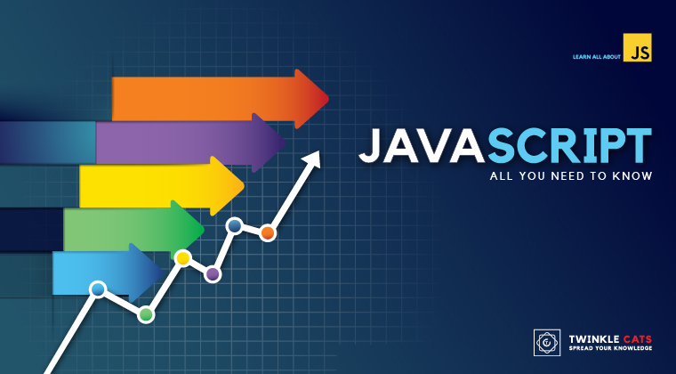

# Javascript All You Need to Know

https://twinklecats.thinkific.com/courses/jayntok

সম্পূর্ণ বাংলা ভাষায় জাভাস্ক্রিপ্টের কমপ্লিট কোর্স। একদম বিগিনার থেকে অ্যাডভান্সড লেভেল সবার জন্য। এবার জাভাস্ক্রিপ্ট শিখবো নিজের মাতৃভাষায়।

জাভাস্ক্রিপ্টের পূর্ণাঙ্গ রেফারেন্স এবং টিউটোরিয়াল

কোর্সটি এমন ভাবে সাজানো হয়েছে যেন প্রোগ্রামিং এর বিগিনার থেকে এক্সপার্ট সবাই এখান থেকে উপকৃত হতে পারে। প্রথম কয়েকটা অধ্যায়ে প্রোগ্রামিং এর ফান্ডামেন্টালস নিয়ে আলোচনা করা হয়েছে। এর পরে জাভাস্ক্রিপ্টের গুরুত্বপূর্ণ তিনটি বিষয় অ্যারে, অবজেক্ট এবং ফাংশন নিয়ে আলোচনা করা হয়েছে। তারপরে ধীরে অ্যাডভান্সড কনসেপ্ট গুলো যেমন ফাংশনাল প্রোগ্রামিং, অবজেক্ট অরিয়েন্টেড প্রোগ্রামিং, স্কোপ, ক্লোজার, প্রোটোটাইপ, অ্যাসিংক্রোনাস প্রোগ্রামিং, ডম ম্যানিপুলেশন এর মত বিষয় গুলো নিয়ে আলোচনা করা হয়েছে। এর সাথে সাথে জাভাস্ক্রিপ্টের বহুবিধ ব্যবহার নিয়েও আলোচনা করার সাথে প্রাক্টিক্যাল করে দেখানো হয়েছে।